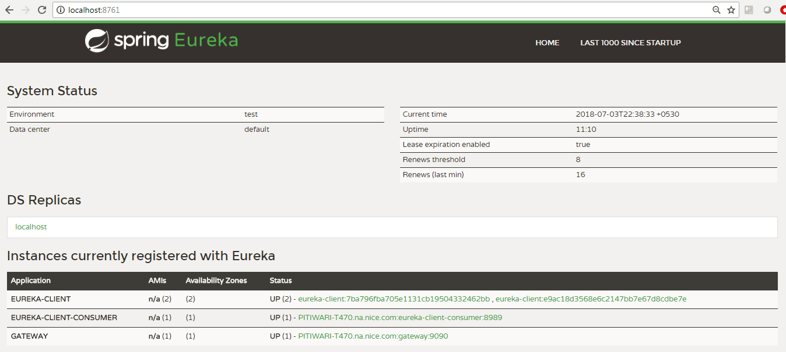

# Spring cloud sample project

This is a multi-module maven project which has following modules:

| **Module Name** | **Description** |
|-----------------|-----------------|
| **service-discovery-server-eureka** | Spring boot application which acts as a service registry (Netflix Eureka) |
| **micro-services-gateway** | Spring boot application which acts as a gateway for all the micro-services |
| **micro-service-eureka-client** | Spring boot application which acts as a eureka client |
| **micro-service-consumer-eureka-client** | Spring boot application which acts as a eureka client and also communicates with above eureka client |

Start the projects from command line using: 

`mvn spring-boot:run`

Follow below steps to see services in action:

1. Start service discovery server.
2. To test that the eureka server load balance between the clients we need to start **two instances/processes** of `micro-service-eureka-client` spring boot application. Just run `mvn spring-boot:run` from two different command windows/terminals.
3. Start the consumer spring boot application `micro-service-consumer-eureka-client` which uses `@LoadBalanced` RestTemplate to enable `Netflix Ribbon` for load balancing the requests. This eureka client exposes following endpoint:

   `GET http://localhost:8989/eureka/client/consume`
   
   which internally makes a call to `http://eureka-client/greeting`. Thing to notice here is that we are calling the client by name i.e. `eureka-client` and ribbon will take care of forwarding the request to appropriate instance of the `eureka-client`.
   
This project also contains a gateway service module `micro-services-gateway` which makes use of `Netflix Zuul Proxy` to forward requests to the appropriate backend service `eureka-client` (Whoever registers itself to Eureka Service Registry).

    GET http://localhost:9090/eureka-client/greeting
  
Snapshot of the eureka dashboard (http://localhost:8761/) where we can see the registered services in one place:  

